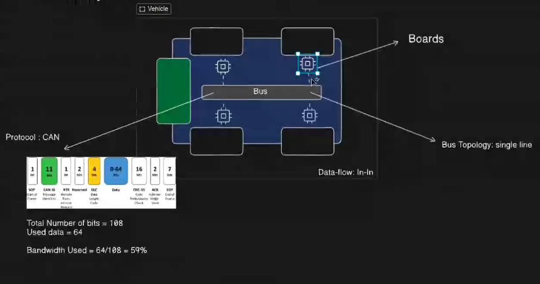
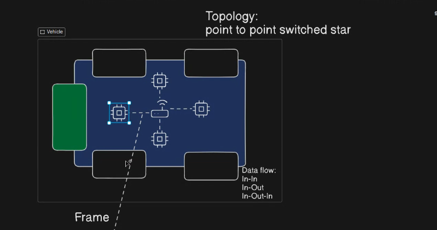
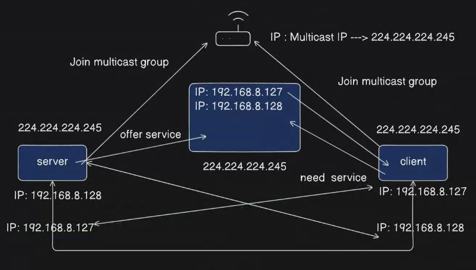
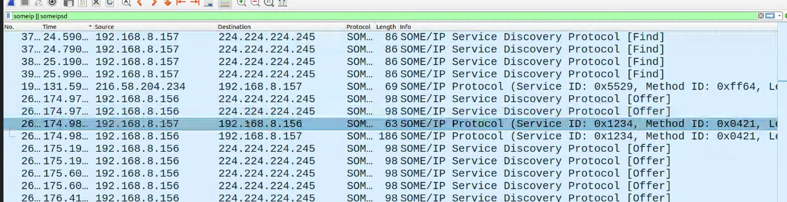

# before Some-IP
- before **2011** we had a Legacy Network, it was some boards in the car with some wires connecting them to the Bus.
It follows the broadcasting technique, where all the ECUs in the car receive the message and decide if it is for them or not. Using the can protocol.
- All the buses inside the car was static , which means we cannot change the busses in the runtime (Kol Board bt send l board mo3ayana).
- Data length was also static .




# After Some-IP
- After **2011**, we have a new network called Some-IP.
- it's based on boards and router(switch) using point to point communication.
- It use the Ethernet protocol with higher speed and more data length.
- We had modern applications like `ADAS` and `Autonomous Driving` that will require a dynamic data length and dynamic routing that's why we can't use the old architecture, For ex suppose the ECU1 is connected to some sensors and it has info from the sensors , ECU1 will create a service with each info from a sensor and if another ECU require this info it will use the service , so it's called `service oriented architecture` , and for sure that will follow the server-client architecture , so any client can go to the server and request a specific service.(Every one has an info will be server and the one who wants it will be client)
- BMW Made two services 
    1. Some-ip:  
    2. Some-ip SD : responsible for the dynamic data path ,it create the connection between the server and the client.


# How Some-IP works:

- Every `client` and `server` has a group number they can `give` and `need` services from it , If we have a server that has a specific srevice so the server will announce him self that he has a specific service in the `multicast group` ((224.224.224.245)) created by the router , then the client will ask for the service it will search for it in the `multicast group` which he has it's number (224.224.224.245) , if the service is found, the client will ask for the service and the server will send the service to the client, then there will be a connection between the server and the client directly by the some-ip.


3
- As you can see in the below fig the client is sending a `find` protocol to the `multicast group` with Ip `224.224.224.245` first then the server will send a `offer` protocol to the 
`multicast group` with Ip `224.224.224.245`  also then he will find it and start direct connection between them 




## Some-IP messages:


# Practical Example:
1. We should start with the hardware configurations , Go to Network interfaces card and allow the multicasting
```bash

